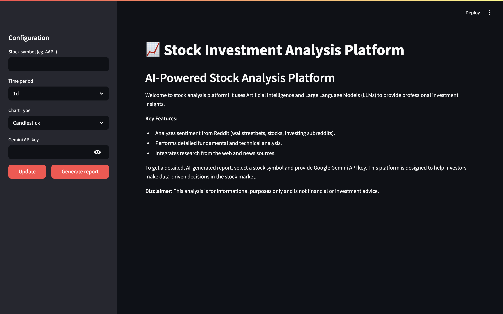
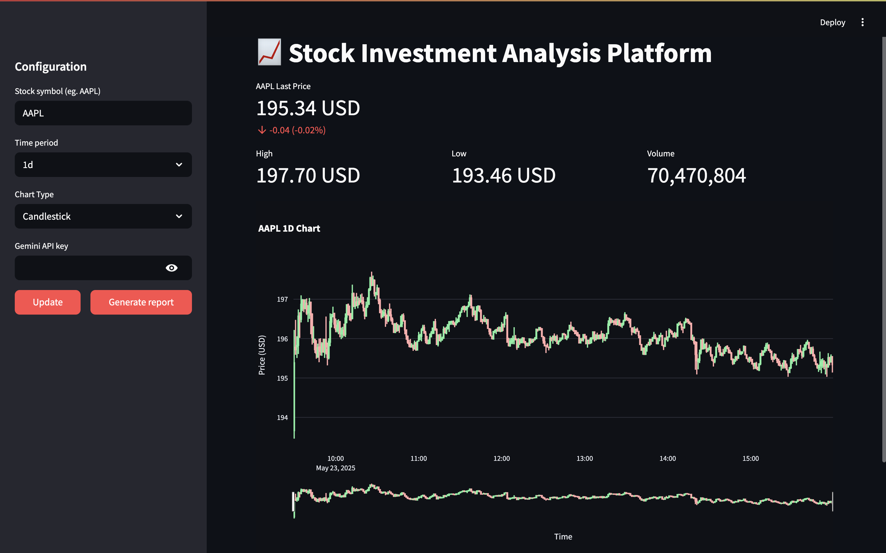
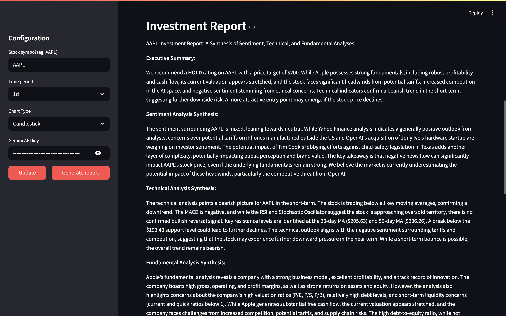

# Stock Investment Analysis Platform (nlp-2025l)

[](https://www.python.org/downloads/)
[](https://streamlit.io)
[](https://www.crewai.com/)
[](https://opensource.org/licenses/MIT) 

## Overview

The Stock Investment Analysis Platform is an AI-powered application designed to provide comprehensive investment insights and generate detailed analysis reports for publicly traded stocks. It leverages a team of AI agents, each specializing in a different aspect of stock analysis, to gather, process, and synthesize information from various sources. The platform aims to help investors make more informed, data-driven decisions.

The final output is a cohesive investment report in Markdown format, offering an executive summary, synthesized analyses (sentiment, technical, fundamental), discussion of convergences/divergences, catalysts, risk factors, and an investment outlook with recommendations.

## Features

* **Multi-Agent Analysis:** Utilizes a team of AI agents (powered by CrewAI and Google Gemini) for specialized tasks:
    * **Senior Stock Market Researcher:** Gathers qualitative data, public sentiment from Reddit, Yahoo News, and Yahoo financial analyses.
    * **Expert Technical Analyst:** Performs in-depth technical analysis using a wide array of indicators.
    * **Senior Fundamental Analyst:** Conducts comprehensive fundamental analysis of the company's financial health, valuation, and market position using Yahoo Finance data.
    * **Chief Investment Strategist:** Synthesizes all analyses into a final investment report.
* **Interactive Web Interface:** Built with Streamlit for easy user interaction, allowing users to input stock symbols and view charts and reports.
* **Data Sources:**
    * **Yahoo Finance (yfinance):** For historical stock data, company information, financial news, analyst estimates, and fundamental data.
    * **Reddit:** For public sentiment analysis on specified subreddits (e.g., r/wallstreetbets, r/stocks, r/investing).
* **Comprehensive Analysis:**
    * **Sentiment Analysis:** Processes Reddit discussions, Yahoo News, and analyst opinions to gauge public sentiment towards the stock.
    * **Technical Analysis:** Calculates and interprets indicators like SMAs, EMAs, MACD, RSI, Bollinger Bands, Stochastics, ATR, OBV, and more. Identifies trends, patterns, support/resistance levels.
    * **Fundamental Analysis:** Assesses financial health, profitability, growth prospects, valuation (P/E, P/S, D/E, ROE, etc.), and overall intrinsic value.
* **Dynamic Charting:** Displays stock price charts (candlestick or line) with configurable time periods using Plotly.

## How it Works (Architecture)

The platform operates using a multi-agent system orchestrated by CrewAI:
1.  The user inputs a stock symbol and API key via the Streamlit interface.
2.  An `StockAnalysisCrew` is initialized, which consists of four distinct AI agents: a Researcher, a Technical Analyst, a Fundamental Analyst, and a Reporter. These agents use Google's Gemini LLM (`gemini/gemini-2.0-flash`).
3.  Each agent is assigned specific tasks:
    * The **Researcher** gathers news from Yahoo Finance, analyst opinions from Yahoo, and sentiment from Reddit discussions.
    * The **Technical Analyst** fetches historical market data from Yahoo Finance and performs technical analysis using TA-Lib.
    * The **Fundamental Analyst** fetches and analyzes company overview, financial statements, and key ratios from Yahoo Finance.
    * The **Reporter** takes the outputs from the other three agents, synthesizes the information, identifies convergences/divergences, and compiles a comprehensive investment report.
4.  The final report is displayed in the Streamlit application.

## Technologies Used

* **Backend & AI:**
    * Python
    * CrewAI (`>=0.119.0`)
    * Google Gemini (via CrewAI LLM integration)
    * Transformers (`>=4.51.3`) (for local sentiment analysis model)
    * PyTorch (`>=2.7.0`)
* **Data Handling & Analysis:**
    * Pandas
    * NumPy
    * yfinance (`>=0.2.61`) (for Yahoo Finance data)
    * PRAW (`>=7.8.1`) (for Reddit data)
    * TA-Lib (`>=0.6.3`) (for technical indicators)
* **Web Interface & Visualization:**
    * Streamlit (`>=1.45.1`)
    * Plotly (`>=6.1.0`)


## Setup and Installation

1.  **Clone the repository:**
    ```bash
    git clone <your-repository-url>
    cd nlp-2025l
    ```

2.  **Create a virtual environment (recommended):**
    ```bash
    make create_environment
    source .venv/bin/activate
    ```

3.  **Install dependencies:**
    ```bash
    make requirements
    ```
    *Note on TA-Lib:* TA-Lib can sometimes be tricky to install. Please refer to the official TA-Lib installation guide for your operating system if you encounter issues.

4.  **Set up Environment Variables:**
    Create a `.env` file in the root directory of the project (`nlp-2025l/`):
    ```
    REDDIT_CLIENT_ID="YOUR_REDDIT_CLIENT_ID"
    REDDIT_CLIENT_SECRET="YOUR_REDDIT_CLIENT_SECRET"
    REDDIT_USER_AGENT="YOUR_REDDIT_USER_AGENT_STRING"
    ```
    Replace the placeholder values with your actual API keys.
    * **Reddit API Credentials:** Create an app on Reddit to get these https://www.reddit.com/prefs/apps. `REDDIT_CLIENT_ID` will be in the left top corner, `REDDIT_CLIENT_SECRET` will be next **secret** field, and `REDDIT_USER_AGENT` can be any string that describes your application.

## Running the Application

Once the setup is complete, run the Streamlit application:
```bash
streamlit run src/app.py
```
## Screenshots
### Main Interface


### Stock Chart


### Generated Report Section in App


## Example Report Output

The platform generates a detailed Markdown report. Here's a snippet from an example report for NVDA ([see full example](results/NVDA.md)):

```markdown
**NVDA Investment Report**

**Executive Summary:**

We recommend a **Hold** rating on NVDA with a price target range of $150-$160 over the next 6-12 months. This recommendation is based on NVDA's strong fundamentals, dominant position in the AI market, and robust growth prospects, tempered by its high valuation and potential short-term technical headwinds. While the long-term outlook remains positive, the current price reflects much of the anticipated growth, and potential risks warrant a cautious approach.

**Sentiment Analysis Synthesis:**

The sentiment surrounding NVDA is cautiously optimistic. Positive sentiment is fueled by significant deals like Oracle's planned purchase of Nvidia chips and Elon Musk's commitment to expanding GPU infrastructure. These developments underscore the strong demand for Nvidia's technology in the AI sector. However, concerns about slowing cloud spending and potential trade headwinds create a mixed sentiment.
...
```

You can find more example reports (like `AAPL.md`) and raw data outputs (like `AAPL_news.json`) in the `/results` directory.


## Authors
* **Daniel Machniak**
* **Rafał Kowalczuk**

## Disclaimer
This analysis is for informational purposes only and is not financial or investment advice. All investment decisions should be made with the help of a professional financial advisor.

## Future Enhancements
* Implement additional data sources for sentiment analysis (e.g., Twitter).
* Expand the range of technical indicators available for customization.
* Implement user accounts and history of generated reports.
* Option to export reports to PDF.